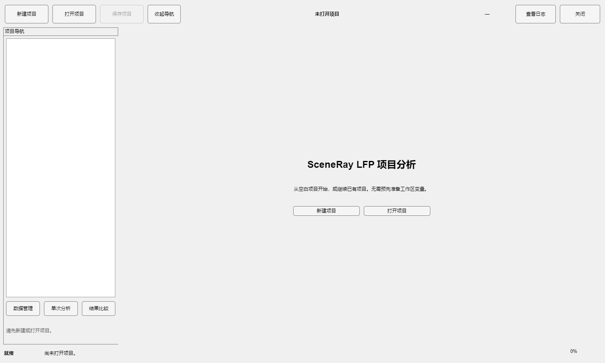
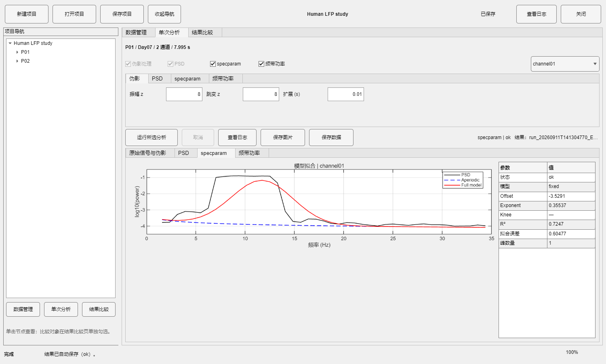
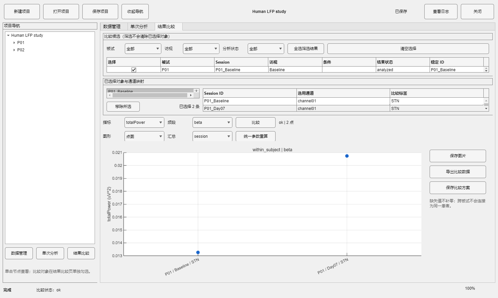
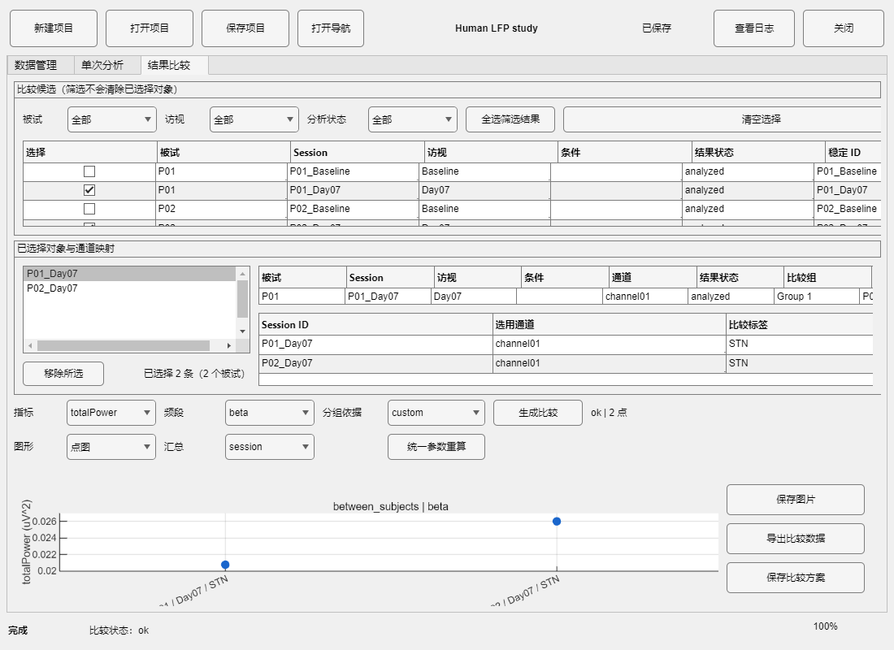

# SceneRay MATLAB LFP Analysis

模块化、可测试的 MATLAB 局部场电位（LFP）分析与可视化项目。当前版本同时提供脚本/API 工作流和 MATLAB 原生 GUI；GUI 只负责交互与状态管理，算法仍可脱离界面调用。

当前本地开发版本：**v0.10.0-dev**。主入口已重构为 Project→Subject→Session→Channel 项目工作区，支持从空白界面完成建项目、导入、单次分析、跨 Session 比较、导出与恢复。原有分析算法、AnalysisRun 缓存和批处理接口保持独立可调用。

## 目标

- 读取 SceneRay 及通用 CSV LFP 数据；
- 保留原始数据并标记疑似伪影；
- 计算 PSD、总功率、相对功率和周期功率；
- 分离周期峰与非周期背景；
- 输出可追溯的参数、结果、图片和处理日志；
- 通过 MATLAB 原生 GUI 或脚本调用同一套分析核心。

## 环境

- 最低设计版本：MATLAB R2022b；
- 当前开发机检测到：MATLAB R2024a、Signal Processing Toolbox、Statistics and Machine Learning Toolbox、FieldTrip；
- 频谱参数化使用项目内置的 MATLAB 原生 specparam 实现；不需要 Python 或外部服务；
- 不在运行时下载依赖。可选工具箱只用于加速或扩展，基础 MATLAB 路径负责核心兼容性。

## 调用的代码、工具包与官方网站

下表列出本项目实际调用、检测或作为算法依据的代码/工具包及其官方地址。核心分析路径只需要 MATLAB 本体，不调用 Python、R、Java、Node.js 或外部服务器。

| 名称 | 代码中的用途 | 是否必需 | 官方网站 |
| --- | --- | --- | --- |
| MATLAB R2022b 或更高版本 | 运行全部分析、绘图和批处理函数；核心 PSD 使用 `fft`、`interp1` 等基础函数 | 必需 | [MATLAB](https://www.mathworks.com/products/matlab.html) |
| MATLAB Unit Testing Framework | 运行 `tests/` 中的 `matlab.unittest` 自动化测试 | 仅开发/测试必需 | [MATLAB Unit Testing Framework](https://www.mathworks.com/help/matlab/matlab-unit-testing-framework.html) |
| Signal Processing Toolbox | 由 `lfp_project_startup` 检测；Welch 与 DPSS multitaper 均提供基础 MATLAB 实现，可用工具箱加速但不是运行必需 | 可选 | [Signal Processing Toolbox](https://www.mathworks.com/products/signal.html) |
| Statistics and Machine Learning Toolbox | 由 `lfp_project_startup` 检测；当前 fixed/no-knee 拟合提供 MATLAB 基础实现，不依赖它 | 可选 | [Statistics and Machine Learning Toolbox](https://www.mathworks.com/products/statistics.html) |
| FieldTrip | `cfg.artifact.method = "fieldtrip"` 时调用 `ft_artifact_zvalue`；默认仍使用 native backend | 可选 | [FieldTrip](https://www.fieldtriptoolbox.org/) |
| specparam | 提供功率谱参数化定义和报告风格参考；本项目使用 MATLAB 原生 fixed/knee 实现 | 参考资料，不是运行依赖 | [specparam documentation](https://fooof-tools.github.io/fooof/) |

EEGLAB 和 Python `specparam` 当前没有被项目代码调用，因此不会影响仅使用 MATLAB 的运行方式；如未来增加对应 backend，会在本表和变更日志中单独注明。

## 当前状态

当前已完成 SceneRay/通用 CSV 导入、导入预览与确认、非破坏性伪影标记、FieldTrip/native artifact backend、artifact-aware Welch 与 DPSS Multitaper PSD、fixed/knee specparam 参数化、Gaussian 周期峰、频带功率点图、结果导出以及 MATLAB 原生项目 GUI。主界面把每份记录绑定到明确的 Subject/Session，并支持向同一 Session 追加多个 CSV；每个通道拥有稳定 `channel_id` 和独立 MAT 原始缓存，长度、采样率或时间轴不同的通道不会被裁剪、补零或重采样。首次同步导入仍保留兼容的 Session MAT。SceneRay 导入器通过寻找每个 `Channel` 元数据行自动识别通道数，并在每个块内部寻找对应的 `Time Index, Voltage, Tag Code` 表头；通用 CSV 可在 GUI 中确认表头、时间列、信号列、采样率和单位。伪影只写入掩码和处理副本，不覆盖原始信号。

通过顶部“新建项目”创建的项目会自动建立可移动的目录：`subjects/<显示名>__<稳定ID>/<Session显示名>__<稳定ID>/` 下保存 `subject.mat`、`session.mat`、`data/`、`configs/`、`results/` 和 `exports/`，项目级比较方案、导出文件和日志分别位于 `comparisons/`、`exports/` 和 `logs/`。导入的源 CSV 会复制到对应 Session 的 `data/`（同名文件自动加后缀），原文件和原始路径仍保留。Subject/Session 重命名只更新显示名和相对引用，稳定 ID 不变；旧的根目录 `data/`/`results/` 项目仍按兼容模式读取。

结果比较页提供按 Subject、访视和状态筛选的稳定 ID 选择表，支持自定义比较组、按 Subject 等权的分组 PSD 曲线，以及分组频带功率条形图和被试代表点。重复 Session 先在被试内汇总，不能因为 Session 或通道更多而获得更大组权重；缺失频段不会补零。单次分析页的频段表可启用、编辑、恢复默认并保存为项目模板，当前频段结构会随 AnalysisRun 保存。

项目不调用 Python 封装；FieldTrip/原生 MATLAB 路径保持纯 MATLAB 运行。

## 快速启动 GUI

在 MATLAB 中把“当前文件夹”切换到仓库根目录，然后只运行：

```matlab
app = launch_gui;
```

无需预先创建变量、导入数据或切换到 `src/`。空白启动页不会自动加载示例数据，也不会强制弹出导入窗口。随后按以下顺序操作：

1. 新建项目或打开包含 `project.mat` 的项目目录；
2. 添加被试，再为被试添加无数据的 Session；
3. 选中 Session 后导入一个或多个 CSV；后续再次导入会追加新通道，预览窗口确认采样率、时间列和信号列；
4. 在“单次分析”页运行伪影、PSD、specparam 和频带功率；
5. 在“结果比较”页独立勾选 Session，确认每条记录的通道映射后比较或导出；
6. 保存并关闭；下次打开时恢复项目、AnalysisRun 和最近保存的比较方案。









## 快速分析

```matlab
addpath('src');
data = lfp_import_scenray_csv("my_recording.csv");
cfg = lfpDefaultConfig();
[cleanData, artifactResult] = detectAndHandleArtifacts(data, cfg.artifact);
psdResult = computeLfpPsd(cleanData, artifactResult, cfg.psd);
modelResult = parameterizePowerSpectrum(psdResult.frequencyHz, psdResult.psd, cfg.fooof);
bandResult = computeBandPower(psdResult, modelResult, cfg.bands);
cleanData.spectrum = psdResult;
cleanData.spectralParameters = struct('aperiodicPsd', horzcat(modelResult.aperiodicFit), ...
    'periodicPowerAboveAperiodic', horzcat(modelResult.periodicFit));
cleanData.bandPower = bandResult;
plotArtifactComparison(data, cleanData, artifactResult, cfg.plot);
plotSpectralModel(modelResult(1), cfg.plot);
plotAnalysisSummary(artifactResult, psdResult, modelResult, bandResult, cfg.plot);
files = lfp_export_results(cleanData, "results");
```

## 多被试、多 Session 项目模式

项目模式不会替代现有单文件入口，而是在其上增加稳定的身份和结果层：

```matlab
addpath('src');
project = lfp_create_project("my_lfp_project", "Human LFP study");
[project, ~] = lfp_project_add_subject(project, ...
    struct('subject_id', "P01", 'display_name', "Patient 01"));
data = lfp_import_scenray_csv("recording.csv");
[project, ~] = lfp_project_add_session(project, "P01", data, ...
    struct('session_id', "P01_Baseline", 'visit_label', "Baseline", ...
           'medication_state', "off", 'stimulation_state', "on"));
% Later imports can be appended to the same Session without aligning channels:
% [project, report] = lfp_project_append_data(project, "P01_Baseline", data2);
[project, ~] = lfp_project_add_csv_session(project, "P01", "recording2.csv", ...
    struct('session_id', "P01_Day07", 'visit_label', "Day07"));
[project, runSummary] = lfp_analyze_project(project, "P01_Baseline");
spec = struct('type', "within_subject", 'session_ids', "P01_Baseline", ...
    'bands', "delta", 'metric', "totalPower");
[project, comparison] = lfp_compare_project(project, spec);
plotProjectComparison(comparison, Band="delta", Metric="totalPower");
files = lfp_export_comparison(comparison, "comparison_output");
```

`lfp_analyze_project` 按 Session 独立执行现有伪影→PSD→specparam→频带功率流程；包含追加文件的 Session 会按启用通道独立计算并在 `results/channels/` 保存隔离结果，单通道失败不会阻止其他通道。数据版本和计算配置指纹一致时复用有效 `AnalysisRun`，否则生成新的结果版本。`lfp_project_get_channel_data` 只读取指定通道缓存；源 CSV 不可用时仍可从项目缓存查看和分析，缓存损坏会显式报错。`lfp_project_append_data` 拒绝同一源文件+列的重复导入及未明确允许的重复标签。`lfp_compare_project` 只读取已保存结果并生成可查询长表，不跨患者拼接原始数据。批处理可通过 `lfp_run_batch(taskStructOrMatFile)` 调用，任务结构包含 `projectRoot`、可选 `sessionIds`、`analysisConfig`、`comparisonSpec` 和 `outputFolder`。

项目管理 API 与 GUI 使用相同的稳定 ID、数据文件和结果缓存；GUI 不把不同 Session 的原始信号拼接计算。

## MATLAB 原生 GUI

推荐入口：

```matlab
app = launch_gui;
```

兼容入口仍可使用：

```matlab
projectApp = launchLfpProjectApp;
legacySingleFileApp = launchLfpApp;
```

`launchLfpProjectApp` 指向同一个项目主界面；`launchLfpApp` 仅保留旧的单文件兼容工作流。项目主界面固定包含顶部项目工具栏、左侧稳定 ID 导航树、数据管理/单次分析/结果比较三个工作页和底部状态栏。比较候选可按被试、访视及分析状态筛选，多选独立于左侧当前查看节点，筛选不会清除已有选择。窗口变窄时主界面自动收起导航，并通过顶部“打开导航/返回工作区”切换，避免关键结果与导出按钮被裁切。

主 GUI 的结果页包含全记录原始/伪影显示、PSD、specparam 模型与峰分解、频带功率。计算结果按 `AnalysisRun` 版本保存；切换 Session 或通道只读取相应缓存并重绘，没有结果时显示空状态。比较页保存对象清单、通道映射、指标、频段和实际结果版本；缺失值保持为 NaN，不补零，不自动执行显著性检验。

导入预览只读取有限行；通用数值 CSV 使用 `readmatrix`，SceneRay 多块文件使用一次流式解析。运行时显示阶段和进度，取消请求会在当前原生计算块的下一个检查点生效。配置指纹只包含计算参数；数据版本或计算参数变化时生成新结果版本，图形样式变化不会触发分析。

旧的 `launchLfpApp` 仍保留多文件单机分析界面和旧会话兼容能力，但新项目应使用 `launch_gui`；两个入口不会共享一份活动 GUI 状态。

v0.6.1 还包含以下 GUI 稳定性修复：CSV 预览、信息栏、伪迹事件表和频段结果表会将字符串/分类值转换为 `uitable` 可显示的字符值，但不会修改原始导入数据或分析结果表；确认导入时会复用已经完成预览的 CSV 内容，SceneRay 数据行解析也采用预分配方式以减少大文件导入耗时。

默认伪迹处理使用逐通道的 native 检测，并启用严格短窗模式（`cfg.artifact.strictMode = true`）。严格模式按窗口内高于 `strictHighpassHz` 的 FFT 能量、导数能量和局部振幅范围检测持续突发，并将候选窗口之间不超过 `strictMergeGapSeconds` 的短间隙一并标记。原始 `data.signal` 始终保留；伪迹只写入 `artifactResult.channelMask`，显示副本 `cleanData.cleanedSignal` 将对应样本标为 `NaN`，不会自动把前后数据拼接或重建。40 Hz 及其 Nyquist 以下谐波默认保留在时域和 PSD 中；specparam不再执行拟合前插值。若明确需要 FieldTrip，可设置 `cfg.artifact.method = "fieldtrip"`，但其时间区间会应用到所有通道。

PSD 默认严格排除包含任意无效/伪迹样本的窗口（`cfg.psd.maxArtifactFraction = 0`），因此被标记的红色区间不会进入默认 PSD、参数化或频段功率分析。若明确需要允许少量污染，可将阈值改为正数（例如 `0.05`）；此时低于阈值的样本只在该 PSD 窗口内线性填补，并记录到 `filledSampleCount`。

## 批量处理文件夹

如果需要一次处理文件夹中的所有 CSV，可以只调用一次批处理入口。每个文件内部的多个 `Channel` 区块会自动变成独立通道列，后续 PSD、参数化和频段功率均按通道分别计算：

```matlab
inputFolder = "C:\Users\PC\Desktop\test";
cfg = lfpDefaultConfig();
batch = analyzeLfpFolder(inputFolder, cfg, ...
    OutputFolder="results", MakeFigures=true, ExportResults=true);

for k = 1:batch.fileCount
    fprintf('%s | IPG SN %s | %d channels | %s\n', ...
        batch.files(k).fileName, batch.files(k).ipgSN, ...
        batch.files(k).channelCount, batch.files(k).status);
end
```

结果中的 `channelLabels`、`channelNames`、`channelCount` 和 `ipgSN` 会保留到每个文件的结果结构与图标题中。批处理只对每个文件执行一次导入、伪影、PSD、参数化和频段功率计算；绘图和导出是可选步骤。

40 Hz 及其 Nyquist 以下谐波保留在原始时域和 PSD 中；`parameterizePowerSpectrum` 直接使用 PSD 实际频率网格，旧配置中的 `interpolateLineNoise` 只会被忽略并记录迁移提示。新的 PSD 默认方法为 `multitaper`，分析范围默认 `[1 35]` Hz；兼容配置字段 `cfg.fooof.frequencyRange` 默认 `[1 35]`。超出 PSD 范围的频带返回 NaN，而不是虚假功率。Multitaper 使用真正的 DPSS 多窗估计，`NW` 为主输入，`W=NW/T`、总平滑带宽约为 `2W`，默认 `K=floor(2NW)-1`。

绘图函数支持 `cfg.plot.parent` 指定 Figure、uipanel 或 uitab；所有分析函数仍可在无 GUI 的 MATLAB 脚本中独立调用。`computeLfpPsd` 和 `computeBandPower` 也会返回带有 `processingHistory` 的结果结构，便于未来 GUI 或批处理保存审计轨迹。

## 初始化测试

在 MATLAB 中从仓库根目录执行：

```matlab
results = runtests('tests');
assert(all([results.Passed]));
```

当前开发版在 MATLAB R2024a 环境中运行完整自动化测试；最终通过数量见本次交付报告。测试运行时可能出现用户本机 FieldTrip 路径优先级提示；这些提示不属于项目测试失败。

也可以检查入口：

```matlab
addpath('src');
info = lfp_project_startup();
disp(info);
```

## 目录约定

```text
src/       分析核心与公共入口
tests/     matlab.unittest 测试
examples/  可运行示例
docs/      架构、数据格式和算法说明
```

## 数据安全

原始数据和生成结果不应提交到 Git。`.gitignore` 默认排除 `data/raw/`、`data/private/`、`results/`、`*_results/` 和 MAT/FIG 文件。

## 版本历史

见 [CHANGELOG.md](CHANGELOG.md)。长期开发规则见 [AGENTS.md](AGENTS.md)。单文件示例见 `examples/example_lfp_analysis.m`，文件夹批处理示例见 `examples/example_lfp_batch.m`。

## 交互式绘图

绘图函数默认创建可交互的 MATLAB 图窗（`cfg.plot.visible = "on"`），可以直接缩放、平移和读取数据光标。GUI 波形默认显示完整记录（`cfg.plot.maxPlotSeconds = Inf`），仍可改为具体秒数。超过 `cfg.plot.maxDisplayPoints` 的 Raw/Clean 波形只在显示层转换为峰谷包络，短尖峰仍可见；分析和导出始终使用完整数组。`plotArtifactComparison` 会将每个通道按 `Raw`、`Clean/display` 两个面板纵向排列；Clean 面板中的伪影样本显示为 `NaN`，不会伪造连续曲线。批处理示例使用 `KeepFiguresOpen=true` 保留图窗；如只需要保存图片，可改为 `false`。

性能测量、限制和可复现基准见 [docs/performance.md](docs/performance.md)。

保存图片默认使用较大的画布（1600×1100 像素）和 300 DPI，可在 `cfg.plot.figurePosition`、`cfg.plot.exportResolution` 中调整。
